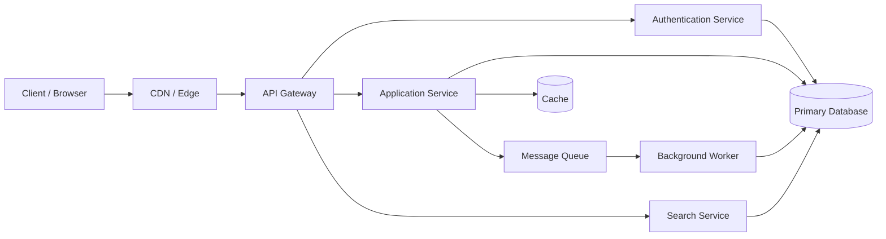

# Architecture Overview

This document provides a high-level overview of the system architecture.

## Components

- Client / Browser: Interacts with the application through the web interface.
- CDN / Edge: Serves static assets and improves delivery performance.
- API Gateway: Routes requests and handles cross-cutting concerns.
- Authentication Service: Manages user authentication and authorization.
- Application Service: Implements the core business logic.
- Search Service: Provides search capabilities over indexed data.
- Primary Database: Stores persistent application data.
- Cache: Improves read performance for frequently accessed data.
- Message Queue: Enables asynchronous communication between services.
- Background Worker: Processes background jobs and events.
